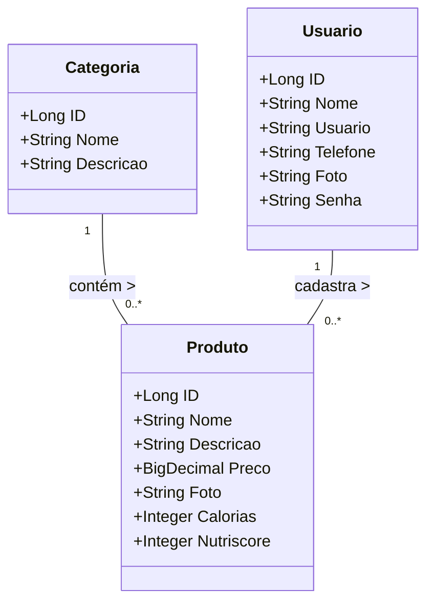

<div align="center">

# GetFood - Sistema de Delivery Completo


</div>

<div align="center">
   
</div>

---

## 🍽️ Descrição

O **GetFood** é uma aplicação completa de delivery, composta por:

- 🔙 **Back-end** com Java + Spring Boot
- 🔝 **Front-end** com React + Vite + Tailwind CSS

O sistema permite o **cadastro e gerenciamento de produtos, categorias e usuários**, com foco na experiência de navegação e integração fluida entre as camadas. Ideal para demonstrar habilidades full stack, integrações REST e boas práticas modernas de desenvolvimento web.

---

## 🌐 Demonstração em Produção

- API: [https://delivery-spring.onrender.com](https://delivery-spring.onrender.com)
- (opcional) Frontend hospedado em: **[inserir link caso tenha deploy](#)**

---

## 🧪 Acesso de Teste

```txt
Email: root@email.com
Senha: rootroot
```

## ⚙️ Funcionalidades

- 📦 Cadastro, listagem, edição e exclusão de produtos
- 🗂️ Gerenciamento de categorias
- 👥 Autenticação e cadastro de usuários
- 📲 Interface moderna e responsiva
- 🔄 Integração com API RESTful usando Axios
- 🔐 Validações com Yup + React Hook Form
- 🔔 Notificações com Toastify e SweetAlert2

## 🧰 Tecnologias Utilizadas

| Camada    | Tecnologias Principais |
|-----------|-------------------------|
| Frontend  | React, Vite, TailwindCSS, TypeScript, Preline, Lucide, React Hook Form, Axios |
| Backend   | Java, Spring Boot, Spring Data JPA, Hibernate, Swagger |
| Banco     | PostgreSQL (Neon em produção) |
| Deploy    | Render (Back-end), Vercel/Netlify (Front, opcional) |

## 🏗️ Estrutura do Projeto

```
getfood/
├── backend/                     # Projeto Spring Boot
│   └── src/main/java/...        # Código da API
├── frontend/                    # Projeto React com Vite
│   └── src/                     # Componentes, páginas e serviços
```

## 🚀 Como Executar Localmente

### 📦 Backend

Acesse a pasta do backend:

```bash
cd backend
```

Configure o banco de dados no `application.properties`:

```ini
spring.datasource.url=jdbc:postgresql://localhost:5432/getfood
spring.datasource.username=seu_usuario
spring.datasource.password=sua_senha
```

Compile e rode o projeto com Maven:

```bash
./mvnw spring-boot:run
```

A API estará disponível em:

```
http://localhost:8080
```

### 💻 Frontend

Acesse a pasta do frontend:

```bash
cd frontend
```

Instale as dependências com Yarn:

```bash
yarn
```

Execute o projeto:

```bash
yarn dev
```

O site estará acessível em:

```
http://localhost:5173
```

## 📡 Integração Front ⇄ Back

O frontend consome os endpoints da API via Axios, com base em uma URL definida em um arquivo `.env`:

```ini
VITE_API_BASE_URL=https://delivery-spring.onrender.com
```

Troque para `http://localhost:8080` em ambiente de desenvolvimento.

## 📌 Diagrama de Classes



## 🤝 Contribuindo

Contribuições são muito bem-vindas! Sinta-se livre para abrir issues ou pull requests com melhorias, correções ou sugestões.

## 👨‍💻 Desenvolvido por

**Grupo 4 - Generation Brasil - Turma Java 82**
